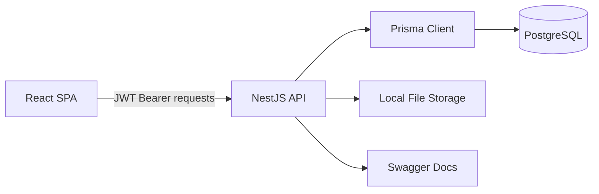
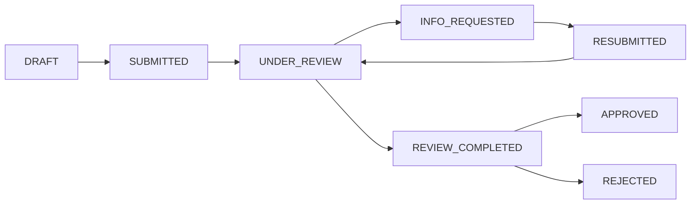

# Architecture

## Problem Framing

The portal replaces an email-and-spreadsheet licensing workflow with a system of record for applications, supporting documents, review decisions, and an audit trail. The implementation prioritizes correctness, traceability, and explicit role boundaries over visual polish.

The backend owns all business rules. The frontend hides actions a user cannot perform, but those checks are convenience only — authorization, ownership, state transitions, separation of duties, and concurrency are enforced by the API.

## Components

- `bnr-bank-licensing-portal-fe` — React/Vite frontend for applicants, reviewers, approvers, and admins.
- `bnr-bank-licensing-portal-be` — NestJS API: authentication, authorization, workflow, audit, documents, and risk scoring.
- PostgreSQL — source of truth for users, applications, document metadata, audit ledger, and risk fields.
- Local file storage — simulated supporting-document storage under backend `storage/`.

## Core Backend Modules

- `auth` — JWT login, guards, role decorators.
- `applications` — CRUD, list/detail queries, workflow endpoints.
- `workflow` — state machine, optimistic locking, Four-Eyes Principle.
- `documents` — upload, versioning, SHA-256 fingerprinting, download verification.
- `audit` — append-only audit ledger, tamper-evident hash chain, verification endpoint.
- `risk` — deterministic risk scoring and risk reasons.
- `users` — admin user management.

## Data Model

Core entities:

- `User` — email, password hash, role, and relations to application actions.
- `Application` — applicant, institution, license type, workflow status, version, risk score, reviewer, approver, review comment, and final-decision fields.
- `ApplicationFile` — versioned document metadata, storage path, uploader, and SHA-256 fingerprint.
- `AuditLog` — append-only audit event with actor, action, before/after state, request context, sequence, previous hash, record hash, and canonical payload.

Foreign keys use restricted deletes so historical applications and audit rows cannot be orphaned. `Application.version` is an optimistic-lock field that increments on each state transition.

## Workflow

Workflow rules:

- Illegal transitions are rejected by the API.
- `APPROVED` and `REJECTED` are terminal final decisions.
- Applicants can only submit/resubmit their own applications.
- Reviewers can start reviews, request info, and complete reviews. Once assigned, only the assigned reviewer can continue.
- Approvers can only decide applications in `REVIEW_COMPLETED`.
- The Four-Eyes Principle prevents the reviewer from making the final decision (both approval and rejection).
- Concurrent state changes use optimistic locking: the update succeeds only when `id`, current `status`, and current `version` still match.

## Role Boundaries

| Role | Can do | Cannot do |
|---|---|---|
| `APPLICANT` | Create, submit, resubmit own applications; upload documents while the application accepts documents; view own applications, documents, and audit trail | Review, approve, reject, or access another applicant's applications |
| `REVIEWER` | Pick up submitted/resubmitted applications, request info, complete reviews with a recommendation comment, view queues and final outcomes | Make final approval or rejection decisions |
| `APPROVER` | Make final decisions on review-completed applications | Review applications, and cannot decide an application they reviewed |
| `ADMIN` | Manage users and read audit data | Modify or delete audit records |

The hard separation-of-duties rule is implemented as the Four-Eyes Principle in `WorkflowService`. See [Security](./security.md#four-eyes-principle).

## Where Next

- [Backend](./backend.md) for module-by-module implementation details.
- [Frontend](./frontend.md) for the SPA structure and user flows.
- [API Reference](./api.md) for endpoints, request bodies, and error envelope.
- [Compliance](./compliance.md) for audit chain, fingerprinting, and risk-scoring details.
- [Decisions](./decisions.md) for the rationale behind the major trade-offs.
